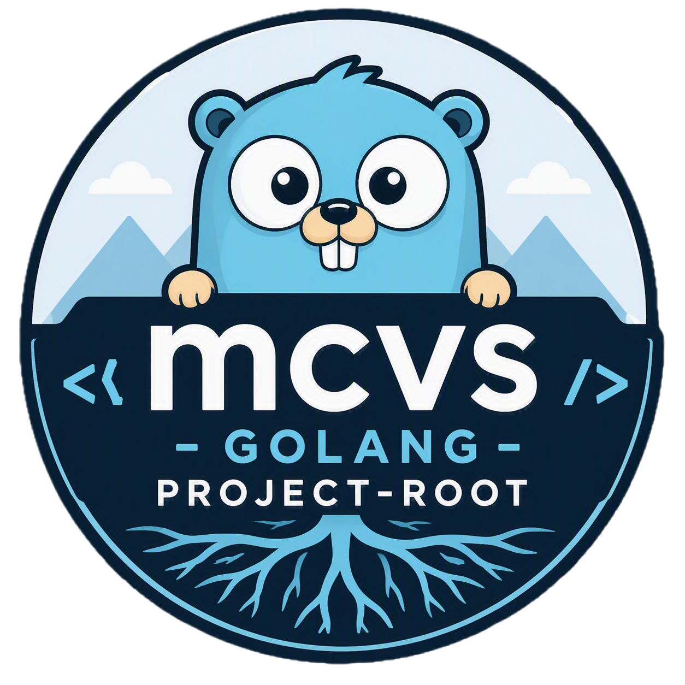

# mcvs-golang-project-root

[](https://github.com/schubergphilis/mcvs-golang-project-root/releases)
[](LICENSE)

</a>

An example can be found [here](./examples). To run it, issue:

```zsh
go run examples/main.go
```
